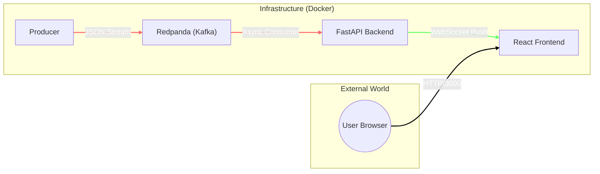

# System Architecture: Real-Time Flight Tracker

## 1. High-Level Overview
This project is an **Event-Driven Microservices Application** designed to visualize geospatial data in real-time. It simulates a supply chain or flight tracking system where moving assets (producers) stream their location to a central dashboard (consumer) with millisecond latency.

The system creates a continuous data pipeline:
`Data Generation` $\rightarrow$ `Ingestion (Kafka)` $\rightarrow$ `Processing (Backend)` $\rightarrow$ `Visualization (Frontend)`

## 2. Architecture Diagram

## 3. Technology Stack

| Component | Technology | Role |
| :--- | :--- | :--- |
| **Producer** | Python 3.9 | Generates synthetic flight data (Lat/Lon/Velocity). |
| **Broker** | **Redpanda** | Kafka-compatible streaming data platform (No Zookeeper required). |
| **Backend** | **FastAPI** (Python) | Consumes Kafka stream and bridges it to WebSockets. |
| **Frontend** | **React** (TypeScript) | Renders the live map using Leaflet.js. |
| **Infra** | Docker Compose | Orchestrates services and internal networking. |

---

## 4. Component Deep Dive

### A. The Producer (`producer.py` / `mock_producer.py`)
* **Responsibility:** Acts as the "Source of Truth."
* **Behavior:**
    * Generates a dictionary containing geospatial telemetry (latitude, longitude, callsign, velocity).
    * Serializes data to JSON.
    * Publishes messages to the Redpanda topic `shipments`.
* **Key Library:** `kafka-python`

### B. The Message Broker (Redpanda)
* **Responsibility:** Reliable data buffering and decoupling.
* **Why Redpanda?** It is a C++ drop-in replacement for Apache Kafka that eliminates the need for JVM and Zookeeper, making it lighter and faster for containerized environments.
* **Configuration:**
    * **Port 9092:** Exposed for external producers (running on the host machine).
    * **Port 29092:** Internal Docker network port for the Backend consumer.

### C. The Backend Service (`app/main.py`)
* **Responsibility:** Data bridging and protocol conversion.
* **Architecture:**
    * **Consumer:** Uses `aiokafka` (AsyncIO Kafka client) to subscribe to the `shipments` topic.
    * **WebSocket Server:** Establishes a persistent, bidirectional connection with the Frontend.
* **Data Flow:**
    1. Reads raw bytes from Redpanda.
    2. Decodes JSON.
    3. Pushes JSON to all connected WebSocket clients immediately.

### D. The Frontend (`frontend/src/App.tsx`)
* **Responsibility:** Visualization and State Management.
* **Architecture:**
    * **React:** Manages the application state (list of active flights).
    * **Leaflet (React-Leaflet):** Renders the interactive map tiles.
    * **WebSocket Client:** Listens for `ws://` events.
* **Optimization:** Uses functional state updates to smoothly animate marker positions without reloading the page.

---

## 5. Network & Infrastructure
The system runs completely isolated within **Docker Containers** using `docker-compose`.

* **Network Driver:** `bridge` (Named `boilerplate_network`).
    * This allows the Backend to resolve the hostname `redpanda` automatically.
* **Volume Mapping:**
    * The Frontend mounts local directories to allow "Hot Reloading" (changes in code update the browser instantly).
* **Port Forwarding:**
    * `3000` -> React Frontend
    * `8000` -> FastAPI Backend
    * `8081` -> Redpanda Console (Dashboard)
    * `9092` -> Redpanda (Kafka Protocol)

---

## 6. Data Packet Lifecycle
A single event travels through the system as follows:

1.  **Generation:** Producer creates `{"callsign": "TEST-1", "lat": 40.7128}`.
2.  **Ingestion:** Sent to Redpanda Topic `shipments`.
3.  **Consumption:** Backend reads the message via internal Docker network (`redpanda:29092`).
4.  **Broadcast:** Backend iterates over active WebSocket connections and sends the payload.
5.  **Render:** React receives the payload, updates the `flights` state array, and moves the `<CircleMarker />` component on the DOM.

---

## 7. Future Improvements
* **Persistent Storage:** Add a database (PostgreSQL/TimescaleDB) to save flight history.
* **Authentication:** Secure the WebSocket endpoint using JWT tokens.
* **ProtoBuf:** Replace JSON with Protocol Buffers for faster serialization in high-load scenarios.

